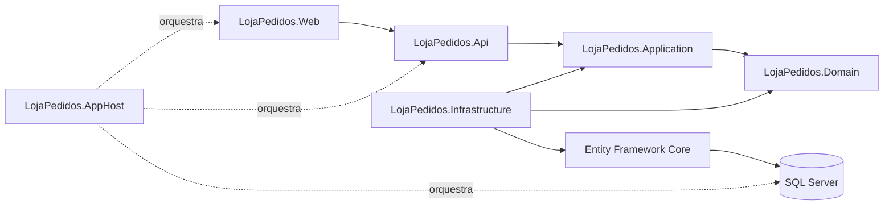

<div align="center">

# 🛍️ Loja Pedidos

### Aplicação para gerenciar o ciclo de vida de pedidos de um e-commerce

Do recebimento ao envio, com regras de negócio, persistência, observabilidade e testes automatizados.

<p>
  &nbsp;&nbsp;&nbsp;
  &nbsp;&nbsp;&nbsp;
  &nbsp;&nbsp;&nbsp;
  
</p>

<p>
  <strong>.NET &nbsp;•&nbsp; SQL Server &nbsp;•&nbsp; Docker &nbsp;•&nbsp; Swagger</strong>
</p>

<p>
  
  
  
</p>
<p>
  
  
  
  
  
</p>

</div>

---

## 📌 Sobre o projeto

A Loja Pedidos API resolve um fluxo completo de vendas: recebe o comprador e os produtos em uma única requisição, registra o pedido e controla cada etapa até o envio ou cancelamento.

O projeto vai além de um CRUD básico. A aplicação protege as transições de status, impede alterações indevidas, calcula o valor total, reutiliza compradores pelo CPF e mantém o preço praticado em cada item. Tudo isso é organizado em camadas para separar as regras de negócio do acesso ao banco e da API.

O ambiente também faz parte da entrega. A solução pode ser iniciada com .NET Aspire ou Docker Compose, possui banco persistente, migrations automáticas, documentação Swagger, telemetria, health checks e testes que exercitam tanto as regras isoladas quanto os fluxos HTTP reais.

### Destaques da entrega

| Área | O que foi desenvolvido |
|---|---|
| **Regras de negócio** | Ciclo completo do pedido, total calculado pelos itens e transições de status protegidas pelas entidades e pelos casos de uso |
| **API REST** | Cadastro e consulta de produtos, além da criação, consulta, alteração, mudança de status e cancelamento de pedidos |
| **Frontend Web** | Interface em Blazor WebAssembly e MudBlazor para utilizar todo o fluxo da API |
| **Consultas** | Listagem paginada com filtros opcionais por CPF e status |
| **Persistência** | SQL Server, Entity Framework Core, migrations automáticas, repositórios e Unit of Work |
| **Ambiente local** | API, frontend e SQL Server orquestrados pelo Aspire, com dashboard e volume persistente |
| **Observabilidade** | ServiceDefaults com health checks, logs, telemetria, resiliência e service discovery |
| **Distribuição** | Docker Compose preparado para consumir imagens públicas da API e do frontend |
| **Qualidade** | Validações, erros padronizados, Swagger documentado e testes unitários e de integração |

## ✅ Principais funcionalidades

- Criação de pedidos com os dados do comprador e os produtos previamente cadastrados.
- Reutilização do comprador quando o CPF já está cadastrado.
- Listagem paginada com filtros opcionais por CPF e status.
- Consulta de pedido por identificador.
- Alteração da quantidade dos itens de pedidos iniciados.
- Processamento, envio e cancelamento por atualização de status.
- Cancelamento lógico de pedidos, preservando o registro no banco com status `Cancelado`.
- Validação de entrada com mensagens em português.
- Respostas de sucesso e erro padronizadas com `ApiResponse<T>`.
- Documentação interativa com Swagger e exemplos de requisições.
- Health checks e telemetria fornecidos pelo ServiceDefaults.
- Testes unitários e de integração.

## 🖥️ Frontend

O projeto `LojaPedidos.Web` é uma aplicação Blazor WebAssembly com componentes MudBlazor. Ele consome os contratos HTTP da API e mantém o tratamento de erros centralizado no cliente de pedidos.

Pela interface é possível criar pedidos, consultar a listagem paginada, filtrar por CPF e status, abrir os detalhes, alterar quantidades, processar, enviar e cancelar. As ações disponíveis acompanham o status atual do pedido, enquanto a validação final e as regras de negócio permanecem na API.

A estrutura principal do projeto Web é:

```text
LojaPedidos.Web/
├── Clients/          # comunicação HTTP com a API
├── Components/       # layout e componentes compartilhados
├── Contracts/        # requests e responses usados pela interface
├── Pages/Pedidos/    # listagem, criação e detalhes
├── Theme/            # tema do MudBlazor
└── wwwroot/          # configurações e arquivos estáticos
```

## 🧰 Tecnologias utilizadas

- **.NET 9 e ASP.NET Core:** base da API REST.
- **Blazor WebAssembly e MudBlazor:** interface web responsiva para consumir a API.
- **Entity Framework Core 9:** mapeamento e persistência das entidades.
- **SQL Server 2022:** banco de dados relacional.
- **FluentValidation:** validação dos dados de entrada dos casos de uso.
- **.NET Aspire:** inicialização da API e do SQL Server, dashboard, logs e telemetria local.
- **Docker e Docker Compose:** execução da API, do frontend e do SQL Server em containers.
- **Swagger / OpenAPI:** documentação interativa dos endpoints.
- **xUnit:** testes unitários e de integração.
- **Refit:** cliente HTTP usado nos testes de integração.

## 🏗️ Arquitetura

A solução separa as responsabilidades em projetos com dependências direcionadas para o domínio:

- **LojaPedidos.Api:** controllers, configuração HTTP, Swagger, CORS e filtro centralizado de erros.
- **LojaPedidos.Web:** páginas, componentes, contratos e cliente HTTP do frontend Blazor.
- **LojaPedidos.Application:** casos de uso, DTOs, validações e contratos usados pela aplicação.
- **LojaPedidos.Domain:** entidades, invariantes do domínio, value objects, exceções e contratos dos repositórios.
- **LojaPedidos.Infrastructure:** DbContext, configurações do Entity Framework, migrations, repositórios e Unit of Work.
- **LojaPedidos.AppHost:** orquestra a API, o frontend e o SQL Server durante o desenvolvimento com Aspire.
- **LojaPedidos.ServiceDefaults:** configura health checks, service discovery, resiliência e OpenTelemetry.
- **LojaPedidos.UnitTests:** valida os requests de pedidos e produtos por meio dos validators.
- **LojaPedidos.IntegrationTests:** inicia o ambiente pelo Aspire e exercita a API por HTTP com Refit.
- **deploy:** reúne o Compose e as variáveis de ambiente usadas na execução com Docker.



## 📋 Regras de negócio

- **Iniciado:** pode ter as quantidades alteradas, ser processado ou cancelado.
- **Processado:** não pode mais ser alterado, mas pode ser enviado ou cancelado.
- **Enviado:** pedido enviado ao comprador; é um estado final.
- **Cancelado:** pedido cancelado; é um estado final.

Também são protegidas regras como comprador obrigatório, CPF válido, pelo menos um item, produto com nome e preço válidos, quantidade maior que zero e proibição do mesmo produto mais de uma vez no pedido.

## 🚀 Como executar

Execute os comandos a partir da raiz do repositório.

### Pré-requisitos

- [.NET SDK 9](https://dotnet.microsoft.com/download/dotnet/9.0)
- [Docker Desktop](https://www.docker.com/products/docker-desktop/), com Docker Compose

### Opção 1: .NET Aspire

Com o Docker Desktop em execução, inicie o AppHost:

```powershell
dotnet run --project src/LojaPedidos.AppHost
```

O Aspire cria o SQL Server com volume persistente, inicia a API e o frontend e apresenta no dashboard os recursos, logs, health checks e dados de telemetria. O endereço do dashboard é exibido no terminal. Use o link **Loja Pedidos Web** ou acesse `http://localhost:5056`. O Swagger da API fica disponível pelo link do recurso `api`.

### Opção 2: Docker Compose

O Compose utiliza a imagem pública:
API - `ghcr.io/vitoriamaira/loja-pedidos-api:latest` 
WEB - `ghcr.io/vitoriamaira/loja-pedidos-web:latest`


Já existe o arquivo local de configuração:

```
 deploy\.env
```

O arquivo `deploy/.env` já acompanha o projeto com as variáveis necessárias para a execução padrão. Não é necessário criar, copiar ou alterar um arquivo `.env.example`.

Suba o ambiente em segundo plano:

```powershell
docker compose --env-file deploy\.env -f deploy\compose.yaml up -d
```

Acompanhe os logs:

```powershell
docker compose --env-file deploy\.env -f deploy\compose.yaml logs -f
```

Encerre os containers:

```powershell
docker compose --env-file deploy\.env -f deploy\compose.yaml down
```

O volume `sqlserver-data` mantém os dados entre reinicializações do ambiente.

O Compose inicia o SQL Server, a API e o frontend. Por padrão, a aplicação web fica disponível em `http://localhost:5056` e o Swagger da API em `http://localhost:8080/swagger`.

## 🗄️ Banco de dados e migrations

As migrations ficam em `src/LojaPedidos.Infrastructure/Migrations`. Na inicialização, a API executa `MigrateAsync` e aplica o seed de dados. Dessa forma, as migrations pendentes e os dados iniciais são processados automaticamente tanto pelo Aspire quanto pelo Compose.

O repositório possui uma ferramenta local do Entity Framework. Para restaurá-la e criar uma nova migration:

```powershell
dotnet tool restore
dotnet ef migrations add NomeDaMigration --project src/LojaPedidos.Infrastructure --startup-project src/LojaPedidos.Api --output-dir Migrations
```

Depois, basta iniciar novamente a aplicação em ambiente de desenvolvimento para aplicar a migration.

## 📖 Documentação da API

- Com Docker Compose: `http://localhost:8080/swagger`
- Com Aspire: use o link **Swagger** exibido para o recurso `api` no dashboard.

Principais rotas:

- `POST /api/produtos`
- `GET /api/produtos?pagina=1&tamanhoPagina=10`
- `POST /api/pedidos`
- `GET /api/pedidos/{id}`
- `GET /api/pedidos?pagina=1&tamanhoPagina=10&cpf=...&status=...`
- `PUT /api/pedidos/{id}`
- `PUT /api/pedidos/{id}/status`
- `DELETE /api/pedidos/{id}`

O Swagger inclui descrições e exemplos reais para os corpos das requisições. Em desenvolvimento, os endpoints `/health` e `/alive` informam a disponibilidade da API.

## 💡 Exemplos de uso

### Cadastrar um produto

`POST /api/produtos`

```json
{
  "nome": "Teclado mecânico",
  "preco": 150.00,
  "imagemUrl": "https://exemplo.com/teclado.jpg"
}
```

### Criar um pedido

`POST /api/pedidos`

```json
{
  "nomeComprador": "João da Silva",
  "cpfComprador": "52998224725",
  "itens": [
    {
      "id": "01980000-0000-7000-8000-000000000001",
      "quantidade": 2
    }
  ]
}
```

A resposta é `201 Created`, contém os identificadores gerados e informa no cabeçalho `Location` a rota de consulta do novo pedido.

### Processar um pedido

`PUT /api/pedidos/{id}/status`

```json
{
  "status": "Processado"
}
```

## 🧪 Testes

O projeto `LojaPedidos.UnitTests` cobre os validators dos requests de pedidos e produtos. O projeto `LojaPedidos.IntegrationTests` usa `Aspire.Hosting.Testing` para iniciar o AppHost e verifica por HTTP os principais fluxos de produtos e pedidos, incluindo criação, consulta, paginação, validações, alteração, mudança de status e cancelamento lógico.

Testes unitários:

```powershell
dotnet test tests\LojaPedidos.UnitTests\LojaPedidos.UnitTests.csproj
```

Os testes de integração iniciam e encerram o ambiente Aspire automaticamente. Mantenha o Docker Desktop em execução e execute:

```powershell
dotnet test tests\LojaPedidos.IntegrationTests\LojaPedidos.IntegrationTests.csproj
```

Para executar os projetos de teste da solução:

```powershell
dotnet test LojaPedidos.sln
```

## ⚙️ GitHub Actions / CI/CD

O workflow `.github/workflows/docker-publish.yml` é executado a cada `push` na branch `main` e também pode ser iniciado manualmente pelo GitHub.

A automação restaura as dependências, compila a solução em modo `Release` e executa os testes unitários. Quando esse job termina com sucesso, dois jobs independentes constroem e publicam as imagens da API e do frontend no GitHub Container Registry (GHCR).

As imagens publicadas são:

- `ghcr.io/vitoriamaira/loja-pedidos-api`
- `ghcr.io/vitoriamaira/loja-pedidos-web`

Cada publicação gera a tag `latest` e uma tag `sha-*`, que identifica a imagem associada ao commit. O workflow utiliza o `GITHUB_TOKEN` para autenticação no GHCR e cache do GitHub Actions para acelerar os builds. Atualmente, o pipeline executa os testes unitários; os testes de integração permanecem disponíveis para execução local com Aspire.

## ✨ Decisões e boas práticas

A organização em camadas mantém as regras do pedido independentes da API e do Entity Framework. Os controllers recebem e devolvem DTOs, enquanto os casos de uso coordenam validações, repositórios e a unidade de trabalho. Essa separação deixa o fluxo mais fácil de entender, testar e evoluir sem adicionar abstrações fora do escopo.

- Injeção de dependência para casos de uso, repositórios e serviços.
- Entidades responsáveis por proteger invariantes dos itens e casos de uso responsáveis pelas transições de status.
- DTOs específicos para entrada e saída, sem expor diretamente as entidades.
- FluentValidation para validar requests antes da execução dos casos de uso.
- Repositórios e Unit of Work para isolar e confirmar a persistência em uma única operação.
- Mapeamentos do EF Core separados com `IEntityTypeConfiguration<T>` e carregados pelo assembly.
- GUIDs ordenáveis, CPF com restrição de unicidade e valores monetários configurados no banco.
- Paginação e filtros opcionais para evitar consultas de listagem sem limite.
- Tratamento centralizado com respostas `ApiResponse<T>` e mensagens compreensíveis.
- Configuração do ambiente Docker centralizada no arquivo `deploy/.env`.
- SQL Server persistido em volumes no Aspire e no Compose.
- Dockerfiles em múltiplas etapas, API executada com usuário não root, frontend servido pelo Nginx e imagens disponíveis no GHCR.
- Health checks, telemetria pelo ServiceDefaults e testes automatizados em dois níveis.
- GitHub Actions para restaurar, compilar, executar testes unitários e publicar as imagens Docker da API e do frontend no GHCR.
- Swagger com descrições e exemplos compatíveis com os contratos reais da API.

## 📁 Estrutura do projeto

```text
src/
├── LojaPedidos.Api
├── LojaPedidos.Web
├── LojaPedidos.Application
├── LojaPedidos.Domain
├── LojaPedidos.Infrastructure
├── LojaPedidos.AppHost
└── LojaPedidos.ServiceDefaults

tests/
├── LojaPedidos.UnitTests
└── LojaPedidos.IntegrationTests

deploy/
├── .env
└── compose.yaml
```

## Considerações finais

O projeto reúne em uma única entrega o fluxo de negócio, a API, a persistência, os testes e a infraestrutura necessária para execução. A proposta foi manter o código simples de acompanhar, mas completo nos pontos que sustentam uma API real: regras consistentes, dados persistidos, ambiente reproduzível, documentação e validação automatizada.


