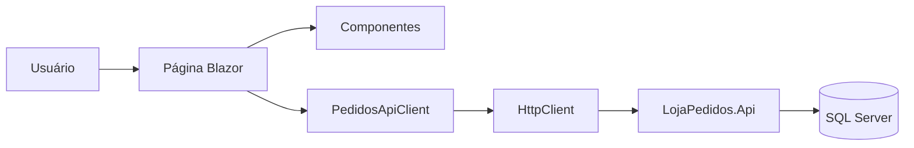
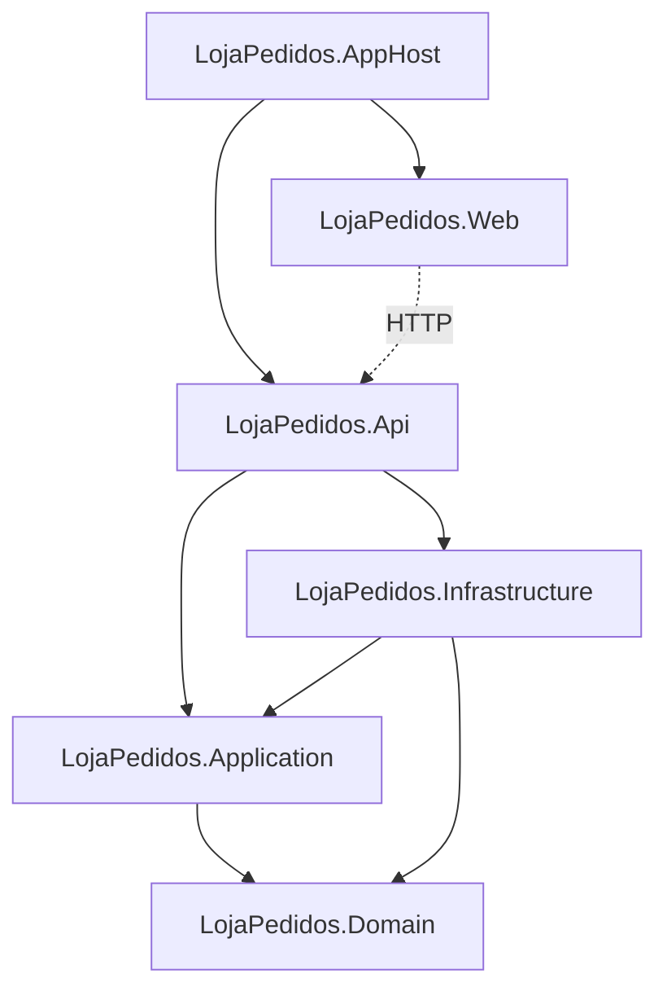
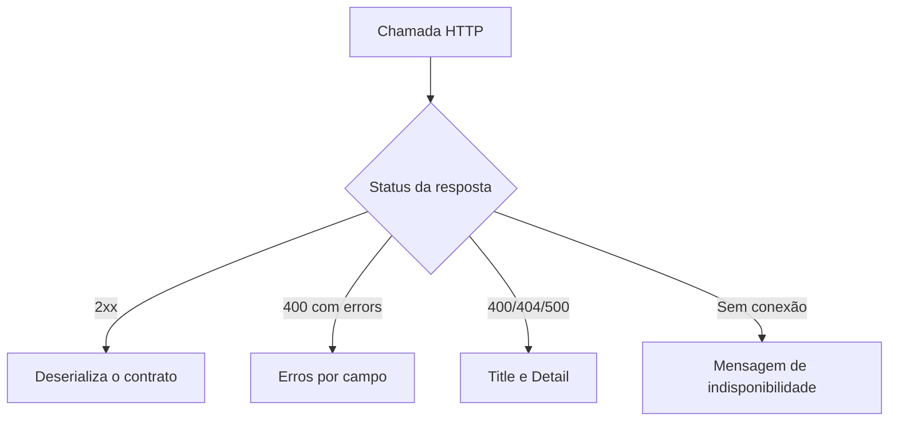

# Arquitetura do frontend - Loja Pedidos Web

## 1. Objetivo deste documento

Este documento define como o frontend Blazor será organizado antes do início da implementação.

A estrutura usa o MenuPark como referência de organização visual e de componentes, mas foi reduzida para o escopo da Loja Pedidos. Os dois projetos têm necessidades diferentes:

- o MenuPark é um Blazor Web App com execução no servidor e chama a camada Application diretamente;
- o Loja Pedidos Web será um Blazor WebAssembly separado e consumirá a API REST por HTTP.

Por isso, a referência será usada para organização das páginas, componentes, tema e estados da interface. As dependências internas do MenuPark não devem ser copiadas.

## 2. O que será aproveitado do MenuPark

Padrões que fazem sentido para a Loja Pedidos:

- organização das páginas por funcionalidade;
- componentes comuns para cabeçalho, status e estado vazio;
- layout separado das páginas;
- tema e cores definidos em um único lugar;
- arquivos `.razor.cs` somente em páginas com mais lógica;
- CSS isolado com `.razor.css` quando o estilo pertence a um componente;
- telas com estados claros de carregamento, vazio, erro e sucesso;
- ações exibidas conforme o status atual;
- resumo do pedido separado do formulário;
- componentes pequenos extraídos somente quando possuem responsabilidade própria.

O que não será levado para a Loja Pedidos:

- referência do frontend para Application, Domain ou Infrastructure;
- handlers chamados diretamente pelos componentes;
- autenticação e autorização;
- multitenancy por estabelecimento;
- SignalR e notificações em tempo real;
- estado global de carrinho;
- vários layouts administrativos;
- FluentMigrator, banco ou repositórios no projeto Web;
- estrutura de commands e queries no frontend.

## 3. Decisão de arquitetura

Será criado um único projeto:

```text
src/LojaPedidos.Web
```

Tipo sugerido:

```text
Blazor WebAssembly standalone - .NET 9
```

O frontend será um cliente da API e não fará parte das camadas internas do backend.



A regra mais importante dessa arquitetura é:

> O projeto Web conhece somente os contratos HTTP necessários para usar a API. Ele não referencia entidades, casos de uso, repositórios ou o DbContext do backend.

## 4. Referências entre os projetos



O `LojaPedidos.Web` não terá `ProjectReference` para:

- `LojaPedidos.Api`;
- `LojaPedidos.Application`;
- `LojaPedidos.Domain`;
- `LojaPedidos.Infrastructure`.

Isso evita o compartilhamento acidental de entidades e mantém o contrato REST como a única comunicação entre front e backend.

O AppHost poderá referenciar o Web apenas para iniciar os recursos juntos. Essa integração será feita depois que o frontend conseguir iniciar sozinho.

## 5. Estrutura proposta

A estrutura inicial deve ser pequena. Novas pastas só serão criadas conforme as telas precisarem.

```text
src/LojaPedidos.Web/
├── Clients/
│   └── Pedidos/
│       ├── IPedidosApiClient.cs
│       └── PedidosApiClient.cs
│
├── Components/
│   ├── Common/
│   │   ├── AppAlert.razor
│   │   ├── AppEmptyState.razor
│   │   ├── AppLoading.razor
│   │   └── AppPageHeader.razor
│   │
│   ├── Layout/
│   │   └── MainLayout.razor
│   │
│   └── Pedidos/
│       ├── PedidoStatusBadge.razor
│       ├── PedidosFilters.razor
│       ├── PedidosTable.razor
│       ├── Pagination.razor
│       ├── PedidoItemsEditor.razor
│       └── ConfirmDeleteDialog.razor
│
├── Contracts/
│   ├── Common/
│   │   ├── ApiProblem.cs
│   │   └── ApiResult.cs
│   │
│   └── Pedidos/
│       ├── CriarPedidoRequest.cs
│       ├── CriarPedidoResponse.cs
│       ├── AlterarPedidoRequest.cs
│       ├── AtualizarStatusPedidoRequest.cs
│       ├── PedidoResponse.cs
│       └── ListarPedidosResponse.cs
│
├── Pages/
│   └── Pedidos/
│       ├── PedidosList.razor
│       ├── PedidoCreate.razor
│       └── PedidoDetails.razor
│
├── Theme/
│   └── AppTheme.cs
│
├── wwwroot/
│   ├── css/
│   │   └── app.css
│   ├── appsettings.json
│   └── appsettings.Development.json
│
├── App.razor
├── Program.cs
└── _Imports.razor
```

Essa é uma visão de destino, não uma lista de arquivos para criar de uma vez. No primeiro passo serão necessários apenas o projeto, o layout, o tema e a configuração da API.

## 6. Responsabilidade de cada parte

### 6.1 Pages

As páginas representam rotas e coordenam a tela.

Responsabilidades:

- receber parâmetros da rota;
- iniciar o carregamento dos dados;
- chamar o cliente da API;
- controlar loading, erro e sucesso;
- decidir quais componentes aparecem;
- navegar após uma operação.

Não devem:

- montar manualmente requisições HTTP em vários pontos;
- conhecer detalhes de `ProblemDetails`;
- reproduzir regras definitivas do domínio;
- conter CSS global;
- acessar classes do backend.

Rotas previstas:

```text
/pedidos
/pedidos/novo
/pedidos/{id:guid}
```

### 6.2 Components/Common

Componentes visuais reutilizados por mais de uma página.

Exemplos:

- cabeçalho com título, subtítulo e ação;
- estado de carregamento;
- estado vazio;
- alerta de sucesso ou erro.

Eles devem receber dados por parâmetros e emitir eventos. Não devem chamar a API.

### 6.3 Components/Pedidos

Componentes específicos do fluxo de pedidos.

Exemplos:

- filtros da listagem;
- tabela de pedidos;
- badge de status;
- editor dos itens;
- paginação;
- confirmação da exclusão.

Eles podem cuidar de interação local, como editar um item ou emitir o clique de uma página. A operação HTTP continua na página ou em um serviço de tela quando isso se tornar necessário.

### 6.4 Clients

O cliente HTTP concentra toda a comunicação com `LojaPedidos.Api`.

Contrato inicial:

```csharp
public interface IPedidosApiClient
{
    Task<ApiResult<CriarPedidoResponse>> CriarAsync(
        CriarPedidoRequest request,
        CancellationToken cancellationToken = default);

    Task<ApiResult<ListarPedidosResponse>> ListarAsync(
        ListarPedidosQuery query,
        CancellationToken cancellationToken = default);

    Task<ApiResult<PedidoResponse>> ObterPorIdAsync(
        Guid id,
        CancellationToken cancellationToken = default);

    Task<ApiResult<PedidoResponse>> AlterarAsync(
        Guid id,
        AlterarPedidoRequest request,
        CancellationToken cancellationToken = default);

    Task<ApiResult<AtualizarStatusPedidoResponse>> AtualizarStatusAsync(
        Guid id,
        AtualizarStatusPedidoRequest request,
        CancellationToken cancellationToken = default);

    Task<ApiResult<ExcluirPedidoResponse>> ExcluirAsync(
        Guid id,
        CancellationToken cancellationToken = default);
}
```

O `PedidosApiClient` será responsável por:

- montar as URLs e query strings;
- serializar requests;
- desserializar responses;
- respeitar `CancellationToken`;
- interpretar `ProblemDetails` e `ValidationProblemDetails`;
- transformar falha de conexão em uma mensagem compreensível;
- nunca lançar uma exceção técnica diretamente para o componente.

No início será utilizado `HttpClient` com `System.Net.Http.Json`. Não é necessário adicionar Refit ao frontend apenas porque ele já é usado nos testes de integração.

### 6.5 Contracts

Os contratos representam o JSON da API.

Eles serão próprios do frontend porque:

- o Web não deve referenciar a Application;
- o contrato HTTP pode evoluir de forma diferente das entidades;
- o frontend precisa de modelos específicos para formulário e apresentação;
- evita expor acidentalmente comportamento do domínio na interface.

Os nomes das propriedades devem acompanhar exatamente o JSON atual da API.

O enum de status será repetido no frontend como parte do contrato HTTP:

```csharp
public enum StatusPedido
{
    Iniciado = 1,
    Processado = 2,
    Enviado = 3,
    Cancelado = 4
}
```

Essa pequena repetição é intencional. Criar um projeto compartilhado apenas para um enum e alguns DTOs aumentaria o acoplamento sem trazer benefício neste momento.

### 6.6 Theme

O tema será o ponto único das cores principais.

Paleta inicial:

```text
Primary      #0F3560
Accent       #DF542A
Background   #F5F7FA
Surface      #FFFFFF
Text         #1F2937
Border       #D8E0E8
Success      #237A57
Error        #B42318
```

As cores são configuradas em `AppTheme.cs` pelo MudBlazor, seguindo a ideia de centralização do MenuPark. Tokens que não fizerem parte do tema ficam como propriedades CSS em `app.css`.

Exemplo:

```css
:root {
    --lp-primary: #0f3560;
    --lp-accent: #df542a;
    --lp-background: #f5f7fa;
    --lp-surface: #ffffff;
    --lp-text: #1f2937;
    --lp-border: #d8e0e8;
    --lp-radius-card: 14px;
    --lp-shadow-card: 0 8px 24px rgb(15 53 96 / 8%);
}
```

Cores não devem ser repetidas diretamente em cada componente.

## 7. MudBlazor ou CSS próprio

O MenuPark utiliza MudBlazor e centraliza o visual em um `MudTheme`. Para a Loja Pedidos, MudBlazor é uma opção adequada porque o sistema precisa de:

- tabela responsiva;
- campos de formulário;
- select de status;
- dialog de confirmação;
- snackbar;
- loading;
- paginação;
- componentes com acessibilidade básica.

### Recomendação

Usar MudBlazor no frontend.

Motivos:

- reduz o tempo gasto criando componentes básicos;
- facilita uma aparência consistente;
- permite aplicar a paleta da Protech em um único tema;
- já existe uma referência prática no MenuPark;
- mantém o foco do teste no consumo correto da API.

Cuidados:

- não misturar vários frameworks CSS;
- não colocar `Style` com cores espalhadas pelas páginas;
- não usar um componente complexo quando HTML simples for suficiente;
- não copiar o tema do MenuPark, apenas seu padrão de centralização;
- fixar uma versão compatível com .NET 9, sem usar versão curinga.

Se a escolha final for não adicionar MudBlazor, a arquitetura permanece igual. Apenas `Theme/AppTheme.cs` deixa de existir e os componentes são implementados com HTML e CSS isolado.

## 8. Organização dos arquivos Razor

O MenuPark separa markup e lógica nas páginas mais extensas. O mesmo padrão será usado com moderação.

### Página pequena

Pode ficar em um único arquivo:

```text
PedidosList.razor
```

### Página com formulário ou várias operações

Pode ser separada:

```text
PedidoCreate.razor
PedidoCreate.razor.cs
PedidoCreate.razor.css
```

Regras:

- `.razor` contém estrutura e ligação dos componentes;
- `.razor.cs` contém carregamento, eventos e estado da página;
- `.razor.css` contém apenas estilo daquela página;
- não separar arquivos pequenos apenas para seguir um padrão visual;
- não deixar lógica HTTP espalhada dentro do markup.

## 9. Estado da aplicação

Não será criada uma store global no início.

Cada página controla:

- dados carregados;
- indicador de carregamento;
- mensagem atual;
- estado do formulário;
- operação em andamento.

Exemplo de estado de página:

```csharp
private bool _carregando;
private bool _salvando;
private string? _erro;
private PedidoResponse? _pedido;
```

O estado só deve virar um serviço scoped se duas ou mais páginas realmente precisarem compartilhar os mesmos dados. Navegação e recarga da API são suficientes para o MVP.

## 10. Tratamento de erros

O cliente HTTP deve devolver um resultado conhecido para a página.

Estrutura simples:

```csharp
public sealed record ApiResult<T>(
    bool Sucesso,
    T? Dados,
    string? Mensagem,
    IReadOnlyDictionary<string, string[]>? Erros);
```

Fluxo:



A página decide como apresentar o resultado:

- validação junto ao formulário;
- snackbar para sucesso;
- alerta para indisponibilidade;
- estado de “pedido não encontrado” no 404 do detalhe.

Não será criado um sistema de exceções próprio no frontend nesta etapa.

## 11. Regras de status na interface

A API continua sendo a fonte da verdade.

O frontend pode orientar a pessoa usuária:

| Status | Ações apresentadas |
|---|---|
| Iniciado | editar quantidades, processar, cancelar e excluir |
| Processado | enviar, cancelar e excluir |
| Enviado | consultar e excluir |
| Cancelado | consultar e excluir |

A visibilidade dos botões melhora a experiência, mas não substitui a validação da API. Se a API rejeitar uma ação, a mensagem retornada deve aparecer na tela.

O `PedidoStatusBadge` será responsável apenas pelo rótulo e pela cor:

- Iniciado: azul;
- Processado: laranja;
- Enviado: verde;
- Cancelado: vermelho.

O texto sempre acompanha a cor para manter acessibilidade.

## 12. Configuração da API

A URL será lida de configuração:

```json
{
  "Api": {
    "BaseUrl": "http://localhost:5080"
  }
}
```

O `Program.cs` registra o cliente uma única vez:

```csharp
builder.Services.AddScoped<IPedidosApiClient, PedidosApiClient>();
```

O endereço final do `HttpClient` será configurado nesse mesmo ponto.

Ambientes previstos:

- API direta/Aspire: `http://localhost:5080`;
- Compose: `http://localhost:8080`.

A porta real do frontend será adicionada a `Cors:AllowedOrigins` na API quando o projeto for criado e a URL puder ser confirmada.

## 13. Integração com Aspire

A integração será feita em uma etapa própria.

Resultado esperado:

```text
LojaPedidos.AppHost
├── sqlserver
├── lojapedidos
├── api
└── web
```

O AppHost deverá:

- iniciar o Web junto da API;
- esperar a API estar disponível;
- mostrar um link para o frontend no dashboard;
- manter o link do Swagger;
- não mover nenhuma regra para o AppHost.

Como o código WebAssembly roda no navegador, o endereço usado pelo cliente precisa ser um endpoint público acessível pela máquina da pessoa usuária. Não deve ser usado o nome interno `api` como URL no navegador.

## 14. Testes do frontend

A arquitetura permite testes em três níveis, mas eles serão adicionados conforme o fluxo aparecer.

### Componentes puros

- badge de status;
- estado vazio;
- paginação;
- filtros;
- editor de itens.

### Cliente HTTP

Usar um `HttpMessageHandler` controlado para testar:

- URL e query string;
- serialização do request;
- resposta de sucesso;
- `ValidationProblemDetails`;
- `ProblemDetails`;
- falha de conexão.

### Páginas principais

Somente os fluxos de maior valor:

- listagem carregada;
- criação e navegação para detalhe;
- alteração de status;
- exclusão confirmada.

Não é necessário testar detalhes internos do MudBlazor nem repetir todos os testes do domínio.

## 15. Dependências previstas

Obrigatórias:

- `Microsoft.AspNetCore.Components.WebAssembly`;
- `Microsoft.AspNetCore.Components.WebAssembly.DevServer`.

Adotada:

- `MudBlazor` 9.7.0, em versão fixa e compatível com .NET 9.

Para testes, somente quando começarem:

- bUnit;
- xUnit.

Não previstos no MVP:

- Refit;
- MediatR;
- AutoMapper;
- FluentValidation no frontend;
- gerenciamento global de estado;
- biblioteca adicional de CSS;
- cliente gerado por OpenAPI.

## 16. Princípios aplicados

### Separação de responsabilidades

- página coordena;
- componente apresenta e emite eventos;
- cliente HTTP comunica com a API;
- contrato representa JSON;
- tema concentra identidade visual.

### KISS

Um projeto Web, um cliente de pedidos e três páginas. Não há necessidade de criar `Web.Application`, `Web.Domain` ou outro conjunto de camadas dentro do frontend.

### DRY

Reutilizar tratamento HTTP, badge, alertas e estados comuns. Não criar uma abstração genérica para cada elemento visual.

### YAGNI

Sem autenticação, store global, cache, SignalR, geração de cliente ou vários layouts enquanto não houver necessidade real.

## 17. Ordem inicial de implementação

A arquitetura será construída em partes pequenas:

1. criar `LojaPedidos.Web` e adicionar à solução;
2. adicionar MudBlazor e configurar o tema;
3. criar `MainLayout`, navegação e rotas vazias;
4. configurar a URL da API e registrar `HttpClient`;
5. criar somente os contratos necessários para a listagem;
6. criar `IPedidosApiClient` com o método de listar;
7. implementar a primeira versão da página de pedidos;
8. validar a chamada real e o CORS;
9. só então iniciar detalhes, criação e demais operações.

O primeiro incremento funcional deve terminar com a listagem da API aparecendo no navegador. Isso valida cedo a arquitetura, configuração e comunicação entre os projetos.

## 18. Decisão final

A arquitetura adotará a organização visual do MenuPark, mas manterá o frontend da Loja Pedidos como um cliente HTTP independente.

Resumo:

```text
LojaPedidos.Web
├── Pages            coordenação das rotas
├── Components       interface reutilizável
├── Clients          acesso à API
├── Contracts        contratos JSON
├── Theme            identidade visual
└── wwwroot          configuração e estilos
```

Essa estrutura é suficiente para o MVP, simples de explicar em uma entrevista e permite crescer sem misturar o frontend com as camadas internas do backend.


